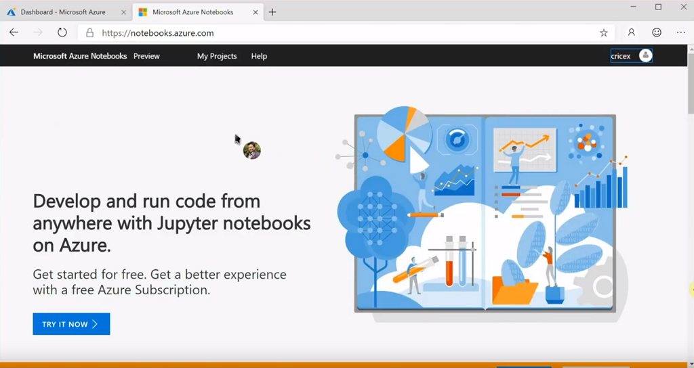
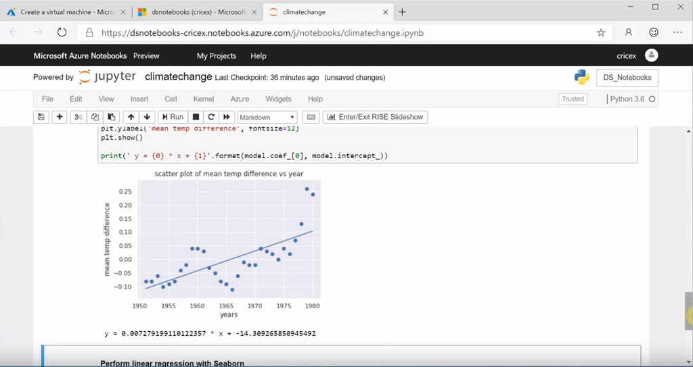
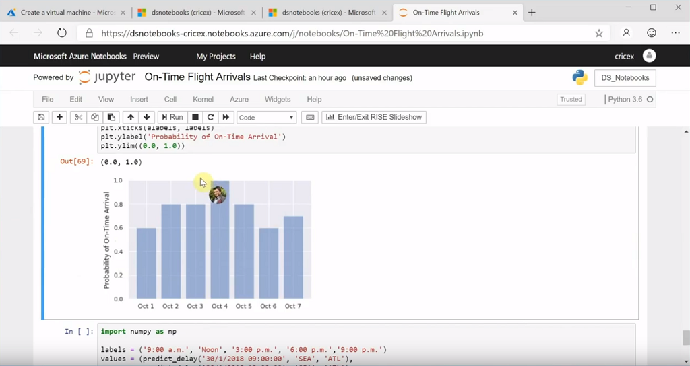
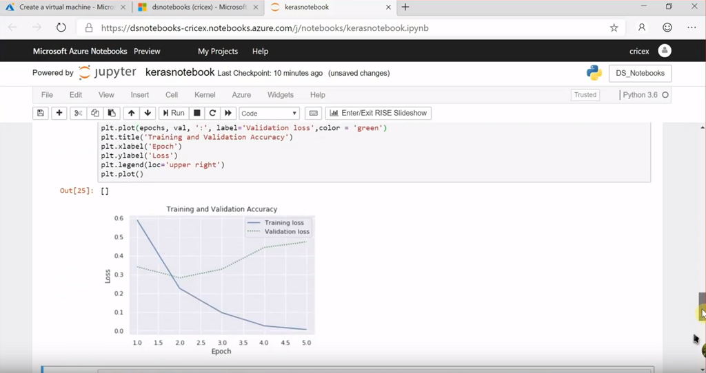

# Training Videos
## Introduction to Machine Learning and Data Science with Microsoft Azure
Charles Rice and Shimail Gillani from Microsoft collaborate with four Masters of Business Analytics students from the McCombs School of Business at the University of Texas at Austin to walk you through getting started with Data Science and Machine Learning in Azure. 

### [Introduction to Azure Notebooks](https://www.youtube.com/watch?v=lvqdap1PPOU&list=PLmlyXr9DRjskd3heUO_xJ8cmQ-7FwwyaA&index=1)
Develop and run code from anywhere using Jupyter Notebooks on Azure through Azure Notebooks.  

### [Analyze NASA climate data with Azure Notebooks](https://www.youtube.com/watch?v=wY2ZOwk5RIw&list=PLmlyXr9DRjskd3heUO_xJ8cmQ-7FwwyaA&index=3&t=0s)
Create an Azure Notebook and use three popular Python libraries to analyze climate data collected by NASA, then share it. This tutorial uses Numpy, Scikit Learn, and Seaborn.   
  
*Follow along step-by-step with the [Microsoft Learn learning path here](https://docs.microsoft.com/en-us/learn/modules/analyze-climate-data-with-azure-notebooks/index)*

### [Predict flight delays through machine learning in Azure Notebooks](https://www.youtube.com/watch?v=rUwvh4elJc8&list=PLmlyXr9DRjskd3heUO_xJ8cmQ-7FwwyaA&index=3)
Import airline arrival data into Azure Notebooks and use Pandas to clean it. Then, build a machine learning model with Scikit-Learn and use Matplotlib to visualize output.  
  
*Follow along step-by-step with the [Microsoft Learn learning path here](https://docs.microsoft.com/en-us/learn/modules/predict-flight-delays-with-python/index)*

### [Sentiment Analysis with Keras in Azure Notebooks](https://www.youtube.com/watch?v=S7SdNB2-_Ao&list=PLmlyXr9DRjskd3heUO_xJ8cmQ-7FwwyaA&index=4)
Keras is a high-level neural networks API, written in Python, that runs on top of other deep learning tools such as TensorFlow. This module uses Keras in conjunction Jupyter Notebooks in Azure Notebooks to build a neural network that scores text, such as user reviews for sentiment.  
  
*Follow along step-by-step with the [Microsoft Learn learning path here](https://docs.microsoft.com/en-us/learn/modules/analyze-review-sentiment-with-keras/index)*